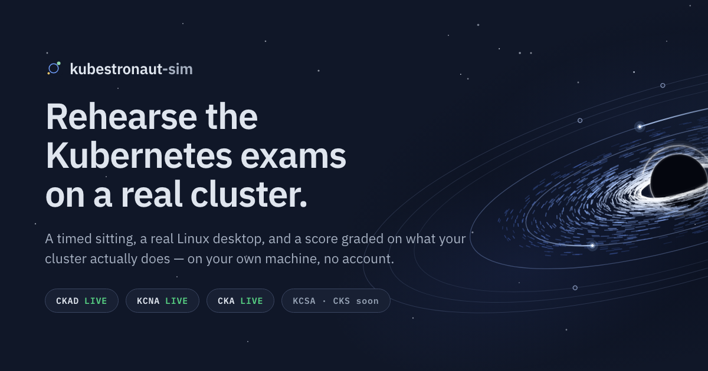
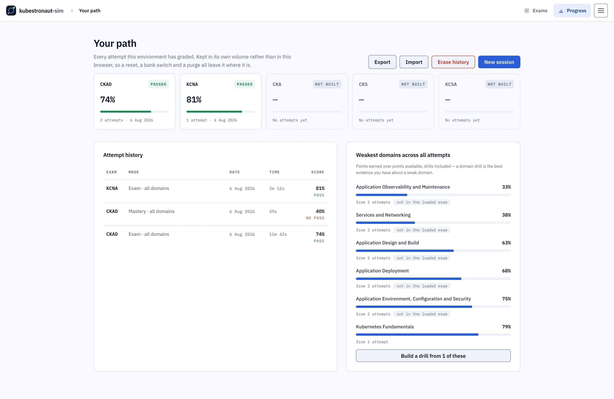
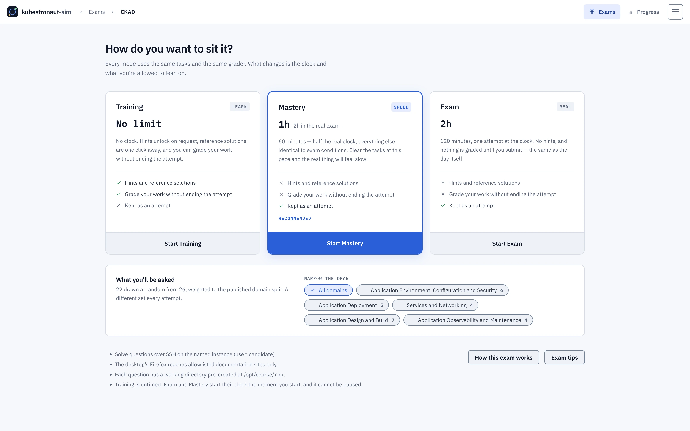
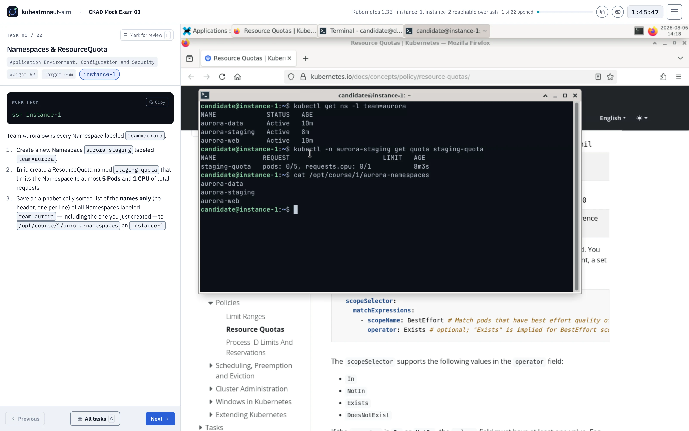
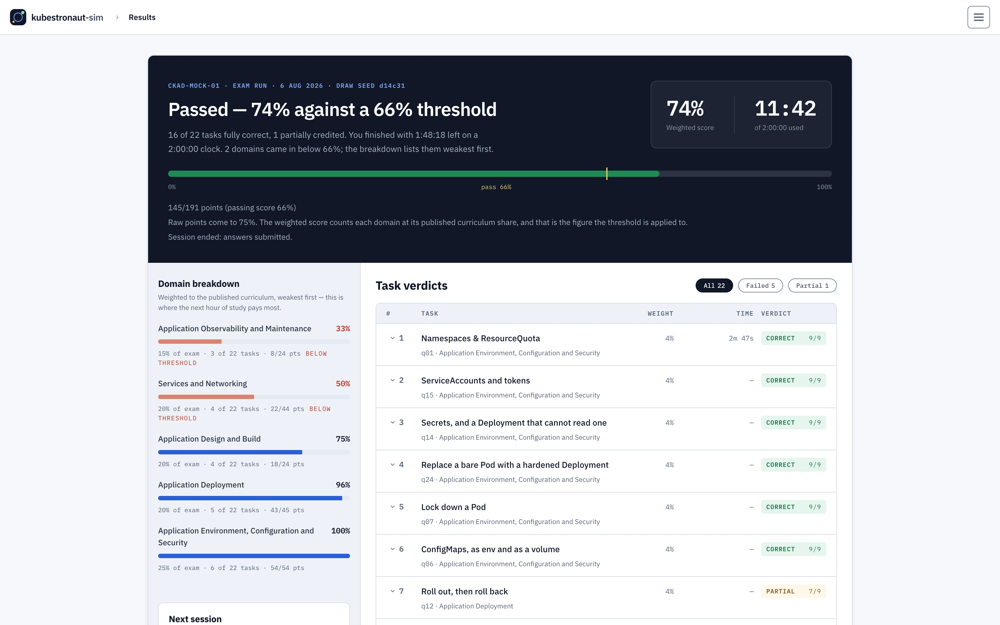

# kubestronaut-sim



An open-source exam simulator for the Kubestronaut certifications, run
locally on your own machine.

- Sit a full exam under a real countdown, on a real cluster.
- Retake it as many times as you need.
- Every graded attempt is kept, so you can see which domains are weak.
- Deliberately harder than the real exams.

<picture>
  <source media="(prefers-color-scheme: dark)" srcset="site/shots/progress-dark.webp" />
  
</picture>

## Quickstart

**Requirements:** Docker Desktop (or docker + compose v2), python3, and
~9GB of free RAM.

```bash
./sim doctor    # preflight: RAM, disk, cgroups, tools
./sim up        # up in seconds
```

Then open <http://localhost:8080> and pick an exam. Everything after
`up` happens in the browser.

> **There is no authentication in this stack.** Ports bind to all
> interfaces by default. On a network you do not control:
>
> ```bash
> SIM_BIND=127.0.0.1 ./sim up
> ```

Nothing is built until you choose an exam. Picking a certification is
what creates its cluster, and the page shows each phase as it completes.

## The exams

| Bank | Engine | Questions | Per attempt | Time | Pass |
|---|---|---|---|---|---|
| CKAD Mock Exam 01 | Hands-on | 26 | 22 drawn | 120 min | 66% |
| KCNA Mock Exam | Multiple choice | 97 | 65 drawn | 90 min | 75% |

- Every draw is stratified to the published curriculum weights.
- CKAD runs against a two-node Kubernetes 1.35 cluster.
- KCNA ships a full explanation for every question.
- CKA, KCSA and CKS appear in the catalog as coming soon.

Hands-on questions are graded on **behaviour**, not on the shape of your
YAML — a policy that actually denies, an Ingress the controller really
routes.

## Sitting an exam

1. **Exams** — pick a certification. Each card shows duration, draw
   size, passing score and engine. Choosing one that is not loaded
   rebuilds the environment, and asks first.
2. **Mode** — pick one:
   - *Training* — untimed, two-tier hints, solutions on demand.
   - *Mastery* — half the clock, no help.
   - *Exam* — the bank's duration, no help.

   <picture>
     <source media="(prefers-color-scheme: dark)" srcset="site/shots/mode-dark.webp" />
     
   </picture>

3. **Exam view** — timer bar, question panel, and the exam desktop in a
   built-in VNC client. The terminal is already open. Firefox is
   restricted to a documentation allowlist.

   <picture>
     <source media="(prefers-color-scheme: dark)" srcset="site/shots/exam-dark.webp" />
     
   </picture>

4. **End** — submit early, or let the timer expire. The desktop locks
   and grading runs in the background.
5. **Score** — percent, pass/fail, per-question checks, full solutions,
   and a New attempt button.

   <picture>
     <source media="(prefers-color-scheme: dark)" srcset="site/shots/score-dark.webp" />
     
   </picture>

Press `?` in the app for the full shortcut list.

### Clipboard

| Direction | How |
|---|---|
| Question → desktop | Highlight text, press ⌘C. No permission needed, any browser. |
| Any app → desktop | Copy, then return to the tab. |
| Paste in the terminal | Ctrl+V, ⌘V, Ctrl+Shift+V, or right-click → Paste. |
| Desktop → host | Chrome only. In Firefox, use the Clipboard panel. |

Text reaching the desktop is reduced to ASCII: an em dash arrives as a
hyphen, curly quotes arrive straight.

### Session behaviour

- `./sim down` then `./sim up` resumes your exam state, including an
  in-progress attempt.
- Light and dark themes follow your system.
- The exam needs a desktop-sized screen. Phones get an explanation
  rather than a broken layout.

## The cluster you get

A kind cluster sized by the exam you picked
(`spec.environment.nodes` in its bank), carrying:

- **Calico** rather than kindnet, so NetworkPolicies are genuinely
  enforced and policy questions can be graded on behaviour.
- ingress-nginx.
- A local Helm repository.
- A plain-HTTP registry for the image-building questions.

Test in-cluster, which is what the graders do:

```bash
kubectl -n <ns> run tmp --rm -it --restart=Never --image=nginx:alpine -- curl -m 5 <svc>
```

## Running it for other people

`./sim up` is uncapped and single-user. To put it in front of a group,
deploy the Helm chart in
[`deploy/helm/`](deploy/helm/kubestronaut-sim). It adds a front door:

- Sign-in.
- A capped pool of concurrent sessions, with a queue.
- Attempt history per user, outliving the environment it was made in.

Each candidate gets the whole eight-container stack as one Pod. The
simulator itself is unchanged.

Read [docs/hosting.md](docs/hosting.md) first: a hands-on session runs a
privileged container, so run it on nodes you are willing to rebuild.

## Where it differs from the real exam

Calibration choices, not gaps.

| Divergence | Reason |
|---|---|
| Harder than the real exam | Pass here, be comfortable there. |
| 22 questions vs a real CKAD's 15–20 | More coverage per sitting. Point budgets still track curriculum weights within 2 points. |
| Two-node cluster | Enough for scheduling, affinity and DaemonSet questions, and it fits in 9GB. |
| Ingress and NodePorts published to your host | Convenience for debugging. No grading check depends on it. |
| Documentation allowlist has no deny-override | Allowing `kubernetes.io` also allows `discuss.kubernetes.io`. |
| Solutions readable in Training | That is the point of the mode. Exam and Mastery keep the gate. |

This is one part of preparing, not the whole of it. It does not replace
working problems out yourself, your own lab, or the Linux Foundation's
training.

## Documentation

| Document | Covers |
|---|---|
| [docs/cli.md](docs/cli.md) | `./sim` subcommands, environment variables, host ports |
| [docs/TROUBLESHOOTING.md](docs/TROUBLESHOOTING.md) | Symptoms and fixes |
| [docs/hosting.md](docs/hosting.md) | The Helm chart and its values |
| [docs/api.md](docs/api.md) | HTTP API for the facilitator, conductor and hub |
| [docs/bank-spec.md](docs/bank-spec.md) | Question bank format and validator contract |
| [CONTRIBUTING.md](CONTRIBUTING.md) | Building, testing, submitting changes |
| [SECURITY.md](SECURITY.md) | Threat model and boundaries |

## License

- **Code:** Apache-2.0 — see [LICENSE](LICENSE) and [NOTICE](NOTICE).
- **Question banks:** CC BY-SA 4.0 — see [banks/LICENSE](banks/LICENSE).

Created and maintained by [Camilo Joga](https://cjoga.cloud).

Not affiliated with CNCF, The Linux Foundation, or PSI. Kubernetes and
the certification names are trademarks of The Linux Foundation.
