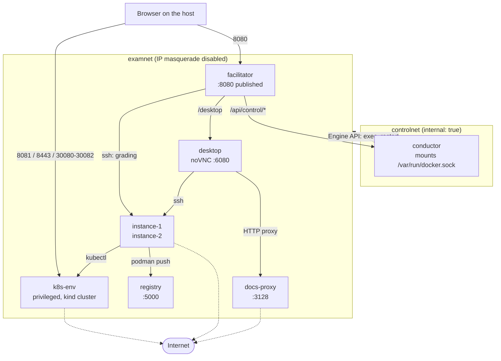

# Architecture

kubestronaut-sim is eight containers, three Go modules that share no
code, and one kind cluster. Read this before changing any of them.

Commands live in [cli.md](cli.md), HTTP endpoints in [api.md](api.md),
bank file layout in [bank-spec.md](bank-spec.md), and the threat model in
[SECURITY.md](../SECURITY.md). None of that is repeated here.

## The shape of the system

The browser talks to one process: the facilitator on port 8080. The exam
desktop and the control API are reached through that same origin, as a
VNC reverse proxy and an HTTP reverse proxy respectively, so the stack
publishes exactly two things — the facilitator, and the cluster's ingress
and NodePort band on k8s-env.

Dashed edges are egress over the `default` network. Nothing else in the
diagram can reach the internet.

## The containers

| Service | Build | What it does | Privilege |
|---|---|---|---|
| `k8s-env` | `images/k8s-env` | Runs Docker-in-Docker, hosts the two-node kind cluster, serves the local Helm repository on :8879, and runs the boot sequence. | `privileged: true` |
| `instance-1`, `instance-2` | `images/instance` | The two shells the candidate works in. sshd, kubectl, helm, podman, and per-question working directories under `/opt/course`. | Five capabilities, `cgroup: host`, writable `/sys/fs/cgroup`, `/dev/fuse`, seccomp and apparmor unconfined |
| `registry` | `registry:2` image | Plain-HTTP push target at `registry:5000` for the image-building questions. | none |
| `docs-proxy` | `proxy` | HTTP proxy on :3128 enforcing the documentation allowlist for the desktop's Firefox. | none |
| `desktop` | `images/desktop` | Xfce under TigerVNC, exposed as noVNC on :6080. Firefox and a terminal; reaches the instances over ssh. | none |
| `conductor` | `conductor` | Reset, reseed, and bank switching. The only container mounting the Docker socket. | no added capabilities, but mounts `/var/run/docker.sock`, which is root on the host |
| `facilitator` | repo root, `facilitator/Dockerfile` | The only published HTTP service: exam API, embedded React UI, the `/desktop` VNC proxy, the `/api/control/*` proxy, and grading. | none |

The service is named `docs-proxy` and its build context is `proxy/`. The
Go module is `kubestronaut-sim/proxy` and the binary is `/docs-proxy`.

Host ports: 8080 from the facilitator, and 8081, 8443 and 30080-30082
from k8s-env. Every one of them binds to `SIM_BIND`. No other service
publishes anything.

The instances and the desktop wait for a healthy k8s-env; the desktop
additionally waits for docs-proxy to have started. The facilitator
deliberately waits for nothing — see
[the boot sequence](#the-boot-sequence).

## The networks and why there are three

| Service | `default` | `examnet` | `controlnet` |
|---|---|---|---|
| `k8s-env` | yes | yes | no |
| `instance-1` | yes | yes | no |
| `instance-2` | yes | yes | no |
| `docs-proxy` | yes | yes | no |
| `registry` | no | yes | no |
| `desktop` | no | yes | no |
| `facilitator` | no | yes | yes |
| `conductor` | no | no | yes |

`examnet` sets `enable_ip_masquerade: "false"`
(docker-compose.yaml:250), so a container attached to it and nothing else
has no route off the host. That is the entire mechanism behind the
desktop having no direct internet access; `tests/smoke.sh:228` asserts it
by curling `https://example.com` from the desktop and requiring the curl
to fail. The desktop's Firefox reaches documentation through
`docs-proxy`, which is also on `default` and therefore does have egress.

`default` is the ordinary compose bridge. Three services need it:
k8s-env pulls images on a cold boot, the instances need `helm repo add`
and `podman build`, and docs-proxy fetches on the desktop's behalf.

`controlnet` is `internal: true` — no gateway, no host port. The
conductor and the facilitator are alone on it.

k8s-env pins its network priorities (`default` 100, `examnet` 10) because
the default gateway is elected across the two, and an election landing on
the masquerade-free `examnet` would blackhole every image pull rather
than failing fast (docker-compose.yaml:48-58).

## The conductor boundary

Resetting the environment and switching banks means destroying and
rebuilding the kind cluster, which needs the Docker socket. That power is
confined to one container: `conductor` is the only service mounting
`/var/run/docker.sock` (docker-compose.yaml:191), it sits alone with the
facilitator on `controlnet` with no host port and no exam network, and
every operation reaches it through the facilitator's `/api/control/*`
reverse proxy (facilitator/internal/api/api.go:85,
facilitator/cmd/facilitator/main.go:170). The boundary being defended is
**privilege, not candidate access** — on a single-user local tool the
candidate can legitimately drive the control API, and a candidate
resetting their own exam is a feature. [SECURITY.md](../SECURITY.md) owns
the rest of the threat model.

The conductor speaks the Docker Engine API directly over the socket
through a hand-written stdlib client with three calls: find a compose
service's container, exec inside it, restart it
(conductor/internal/docker/docker.go:1-5). Keep it at three, and keep the
docker CLI out of the image: the narrower the client, the less a
socket-holding container can be talked into doing.

## The three Go modules

| Directory | Module path | Binary | Built from |
|---|---|---|---|
| `conductor/` | `kubestronaut-sim/conductor` | `/conductor` | `conductor/` |
| `facilitator/` | `kubestronaut-sim/facilitator` | `/facilitator` | repo root |
| `proxy/` | `kubestronaut-sim/proxy` | `/docs-proxy` | `proxy/` |

All three declare Go 1.24 and have **zero external dependencies**. No
`go.sum` exists anywhere in the repo, and none should: a stdlib-only
build is what lets every image compile from a bare `golang:1.24-alpine`
stage with no module download and nothing to pin.

The three communicate over HTTP and never by import. No module's code
appears in another module's build.

None of them parses YAML either. Each image's entrypoint shells out to
`yq` to pre-convert the bank files to JSON and hands the Go binary a path
(facilitator/entrypoint.sh:13, conductor/entrypoint.sh:8-13).

The build asymmetry is deliberate. conductor and proxy build from their
own directory, so their Dockerfiles can `COPY go.mod ./` and see only
themselves. The facilitator sets `context: .` with an explicit
`dockerfile: facilitator/Dockerfile` (docker-compose.yaml:203-205)
because its first stage runs Vite over `ui/` and needs that directory in
the build context (facilitator/Dockerfile:1-6). The compiled `ui/dist` is
copied into `internal/web/dist` and embedded into the binary, so the
facilitator image serves the React UI with no web server beside it.

## The boot sequence

k8s-env reports eight phases (images/k8s-env/phase.sh:23).

| Step | Phase | What it does | Script |
|---|---|---|---|
| 1 | `dockerd` | Start the inner Docker daemon, bounded at 180s | `start.sh` |
| 2 | `helm-repo` | Package `banks/_charts` and serve them on :8879 | `start.sh` |
| 3 | `create-cluster` | `kind create cluster`, write `/shared/kubeconfig` | `bootstrap.sh` |
| 4 | `api-server` | Wait for `/readyz` | `bootstrap.sh` |
| 5 | `cni` | Apply Calico, wait for nodes Ready | `bootstrap.sh` |
| 6 | `ingress` | Label the control plane, apply ingress-nginx | `bootstrap.sh` |
| 7 | `seed` | Run each question's `setup.sh` | `bootstrap.sh` |
| 8 | `finalize` | Touch `/shared/ready` | `bootstrap.sh` |

`phase.sh` renders the current phase to `/shared/boot.json` with jq and
moves it into place from a temp file. Write it atomically or not at all:
the facilitator reads that file on an unsynchronised 2s poll and must
never catch it half-written (images/k8s-env/phase.sh:17-20).

One phase file, two consumers, no second opinion. `./sim up` polls
`GET /api/boot` and prints each label as it changes (sim:39-49); the
browser's boot screen polls the same endpoint. Neither computes progress
of its own.

`/shared/ready` remains the authority on readiness. The compose
healthcheck tests for that file and nothing else, and the final phase
only makes the JSON agree with it
(images/k8s-env/bootstrap.sh:202-206).

The facilitator declares no `depends_on` at all
(docker-compose.yaml:217-228). It must answer within seconds of `up` so
the browser can render boot progress through a cold first boot, which is
the stretch a candidate most needs narrated; `POST /api/session/start`
returns 409 until the environment is genuinely ready, which is the
protection a dependency would otherwise have provided.

Failures surface as state, not as silence. bootstrap.sh traps `ERR` and
writes the failing command into the phase file
(images/k8s-env/bootstrap.sh:10), and start.sh keeps the container alive
after a failed bootstrap so the UI can render the message and the
conductor can still exec a retry into it (images/k8s-env/start.sh:75-84).

## The cluster

Two nodes, one control plane and one worker
(images/k8s-env/kind-config.yaml:20-58).

**Calico, not kindnet.** kind's default CNI does routing and does not
implement NetworkPolicy, which would leave policy questions gradeable
only on the shape of the YAML and leave the candidate unable to test
their own answer (kind-config.yaml:7-13). The pod subnet stays at kind's
`10.244.0.0/16` rather than Calico's `192.168.0.0/16` default: the
simulator publishes ports on the host's LAN address, and a 192.168/16 pod
network overlaps the range most home and office networks use
(kind-config.yaml:14-19).

**ingress-nginx pinned to the control-plane node.** Only that node
carries the `extraPortMappings` for 80 and 443, and the controller binds
them by hostPort; bootstrap.sh labels the node `ingress-ready=true`
before applying the manifest (images/k8s-env/bootstrap.sh:145). NodePorts
need no pinning — kube-proxy answers them on every node.

**The local Helm repository is packaged and served by
`images/k8s-env/start.sh:56-68`, not by bootstrap.sh.** It has to exist
before seeding starts, because a Helm question's `setup.sh` installs
releases from it, and start.sh runs once per container while bootstrap.sh
re-runs on every reset and bank switch — a second httpd would fail to
bind. bootstrap.sh says as much in place of the code
(images/k8s-env/bootstrap.sh:151-152). Charts come from `banks/_charts`
and are indexed against `http://k8s-env:8879`.

**The registry is a compose service, not something bootstrap creates.**
`registry:2` on `examnet` alone: plain HTTP, no auth, no host port, no
internet.

The port chain from the host runs: published compose port -> the k8s-env
container's network namespace -> the control-plane node's
`extraPortMappings` -> ingress-nginx's hostPort or a NodePort Service.
Host 8081 and 8443 map to node 80 and 443; 30080-30082 map straight
through.

## One attempt, end to end

| Step | Owner | What happens |
|---|---|---|
| Lobby | facilitator | Serves the embedded UI, the bank catalog through the control proxy, and `GET /api/exam`. |
| Start | facilitator | `POST /api/session/start` moves idle -> running and arms an expiry timer. 409 until k8s-env is ready. |
| Work | desktop, instances | The candidate drives Xfce over noVNC, reaches `instance-1` and `instance-2` over ssh, and reads docs through docs-proxy. |
| End | facilitator | Submit, or the timer expires. running -> ended, and the desktop locks. |
| Grade | facilitator | `internal/evaluate` runs every check over ssh, asynchronously. |
| Score | facilitator | `GET /api/results` serves the graded breakdown; solutions unlock. |

The mode is chosen once at start and is immutable for the life of the
attempt: `exam` is the bank's duration with no help, `training` is
untimed with hints and solutions live, `speed` is half the duration with
no help. Every gate that depends on the mode reads server-side state and
never a request field (facilitator/internal/session/session.go:38-51).

Grading runs inside the facilitator. `evaluate.Grade` walks each
question's `validate.d` checks and runs each one as
`ssh root@<instance> ...` under a 30s per-check deadline, awarding the
check's points on exit 0. This is the only code in any of the three
modules that uses `os/exec`
(facilitator/internal/evaluate/evaluate.go:16); the facilitator shells
out to the `ssh` binary rather than importing an SSH client so the module
stays stdlib-only. Its `Scoreboard` method renders the same plain text
`./sim grade` prints, from the same values the API returns.

Submit and auto-end at 0:00 converge on one CAS-guarded grader, so the
session-end handler and the expiry callback cannot both start a run for
the same attempt (facilitator/cmd/facilitator/grader.go:15-29).

`/desktop` returns 403 while no session is running, and while locked the
backend is never dialed at all — not even for a health check
(facilitator/internal/desktop/proxy.go:11-12). That gate exists for
fidelity with the real exam, not for security.

## State and volumes

Eight named volumes and four bind mounts.

| Volume | Holds | Written by |
|---|---|---|
| `shared` | Boot state, readiness marker, active bank, kubeconfig, ssh key, motd, Helm repo | `k8s-env`, `conductor` |
| `dind` | The inner Docker daemon's image cache and state | `k8s-env` |
| `course-1`, `course-2` | `/opt/course` on each instance | `instance-1`, `instance-2` |
| `containers-1`, `containers-2` | podman container storage on each instance | `instance-1`, `instance-2` |
| `session` | `/session/session.json`, the session state machine's persistence | `facilitator` |
| `registry` | Images pushed by the image-building questions | `registry` |

Bind mounts: `./banks` read-only into k8s-env, both instances,
docs-proxy, conductor and facilitator; `./tests` read-only into both
instances; `/var/run/docker.sock` into the conductor; `/sys/fs/cgroup`
read-write into both instances.

`shared` is the only volume more than one service touches. k8s-env and
the conductor mount it read-write; the instances, desktop, docs-proxy and
facilitator mount it read-only. Nothing else may take a writable mount of
it — a single writer per file is what makes the unsynchronised polling of
`/shared/boot.json` and `/shared/ready` safe.

`/shared/bank` is the active-bank pointer. k8s-env creates it on first
boot from the `BANK` environment default
(images/k8s-env/bootstrap.sh:21); the conductor owns it from then on, and
a bank switch rewrites the file and re-runs bootstrap. Every bank-aware
entrypoint prefers the file over the compose-time environment variable,
so `./sim up <other-bank>` against a warm stack keeps the bank that is
already active. Switch banks from the lobby.

| Command | Volumes | Effect on the next boot |
|---|---|---|
| `./sim down` | all kept | Resumes: same cluster, same candidate work, no re-seed |
| `./sim reset` | all kept | Rebuilds the cluster and wipes the instances through the conductor; cached images survive |
| `./sim purge` | all eight destroyed | Cold boot: node image load, image pulls, full seed |

A resumed cluster is never re-seeded. bootstrap.sh runs the bank's
`setup.sh` scripts only for a cluster it created in this run, because
re-seeding would overwrite candidate work
(images/k8s-env/bootstrap.sh:157-175).
