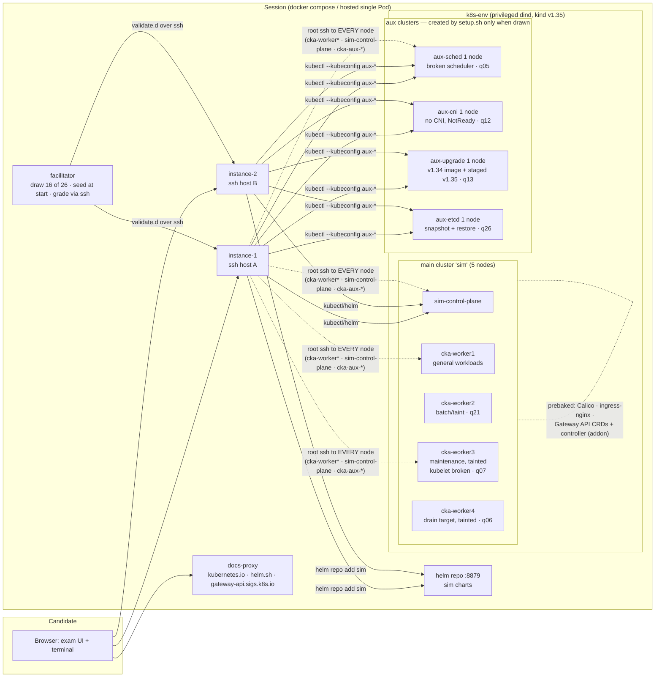

# CKA track plan — research synthesis and question pool design

Design document for the `cka-mock-01` bank and the infrastructure it needs. Written 2026-08-12
from three research passes: this repo's exam-engine architecture, the official 2026 CKA exam
(curriculum v1.35, format, environment), and community question banks and exam-experience reports.
Nothing here is implemented yet; the milestones at the end are the build order.

**Direction decided up front:** build the full bank in one iteration; install a real Gateway
controller (not CRDs-only) so Gateway questions grade behaviorally; add node-ssh plumbing; do not
exclude disruptive archetypes — give them dedicated workers or per-question aux kind clusters; and
above all **full CKA experience, no guardrails**: candidates get root ssh to every node of every
cluster (main control plane included), harmful actions are never prevented — a broken cluster
simply scores as failed, exactly like the real exam — and a purge/hard-reset path lets them
rebuild and start a new attempt to learn from the mistake. Grader instances stay at two (the
`allowedInstances` contract); every node becomes a candidate ssh target.

## The 2026 CKA in one page

The 2026 CKA is a 2-hour, online-proctored, performance-based exam of **15–20 tasks (16 observed
consistently)** on **Kubernetes v1.35**, pass mark **66 %**, partial credit per sub-task, per-task
weight % shown (real weights are non-uniform, 1–10 %; a handful of heavy tasks carry ~40 % of the
score). Domains: **Troubleshooting 30 · Cluster Architecture, Installation and Configuration 25 ·
Services & Networking 20 · Workloads & Scheduling 15 · Storage 10**.

The Feb-2025 overhaul added Helm, Kustomize, Gateway API, NetworkPolicies, CRDs/operators,
extension interfaces (CNI/CSI/CRI), dynamic provisioning, workload autoscaling, and node
troubleshooting — 2026 test-takers report **about half the exam** is this new content, often
combined (Helm+CRD, Ingress→Gateway migration). It **removed etcd backup/restore outright** (no
etcd bullet remains; etcd.io is not in the allowed-docs list) and folded the explicit
kubeadm-upgrade bullet into "manage the lifecycle of Kubernetes clusters".

The environment is a PSI/XFCE remote desktop with a terminal, VSCodium, and Firefox locked to
kubernetes.io/docs + blog, helm.sh/docs, and gateway-api.sigs.k8s.io (CKA only). The post-2025
access model is **ssh-per-task from a `base` host**: each task's infobox names the host, aliases do
not persist across hosts (`k` + bash completion and `yq` are preinstalled on every host), `sudo -i`
gives root, the candidate must `exit` back to base between tasks, nested ssh is unsupported. Tasks
are imperative, exactly-named, independent of one another, attemptable in any order with flagging.

The sim already models most of this: per-question `instance:` mirrors ssh-per-task, the draw/pool/
tier machinery mirrors the 16-of-N format, crit/report mirrors sub-task partial credit, and the
docs-proxy mirrors the allowlist. The gaps this plan closes: Gateway API support, node-shell
access, the bigger cluster, and the CKA question bank itself.

## Research findings

### A. What the repo already provides (and its one hard ceiling)

**Bank format** ([bank-spec.md](bank-spec.md), reference bank `banks/ckad-mock-01/`):

- A bank = `banks/<id>/exam.yaml` + `q*/` dirs. Per question: `question.md` (body only, no
  heading), `setup.sh` (idempotent, runs on `k8s-env` as root), optional `files/`
  (→ `/opt/course/<n>/`, `cp -Rn`), optional `expected/` (generated from the reference solution,
  filtered by `k8s_clean`), `hints.md` (two tiers, all-or-nothing per bank),
  `validate.d/NN_name.sh` graders, `solution.md`.
- Reference solutions live at `tests/solutions/<bank>/<qid>.sh`; smoke fails if any pool question
  lacks one.
- `exam.yaml` question keys must stay in order `id / title / instance / domain / weight`, with
  `targetSeconds`/`difficulty`/`docs` strictly below `weight:` (regex-parsed by
  `tests/bank-weights.sh`).

**Grading** (`banks/_lib/checks.sh`, `facilitator/internal/evaluate/`):

- `crit WEIGHT desc failmsg [note] -- cmd` + final `report` (must be the last line). Gates (echo +
  evidence + exit 1) only for not-done / pinned-name-wrong / forbidden-action. 1-point checks are
  all-or-nothing.
- Checks run on `instance-1/2` over ssh, as root, admin kubeconfig, 30 s hard timeout (timeout =
  failed).
- Lint deny-list (`tests/check-lint.sh`): no `diff`, no grep-on-YAML, no `kubectl -o yaml` (except
  piped into `k8s_clean` for `show_actual`/`show_expected` on the same line), no `kubectl run`, no
  `grep -qx`, no code after `report`. `tests/check-evidence.sh` runs every check against a stubbed
  kubectl.
- Never grade: restart counts, Pod IPs, controller-generated names, line order, host port
  mappings, anything a resume/restart changes.
- Points derive from `domainWeights` (domain budget over the pool); a question's `weight:` must
  equal the sum of its checks' `# points:` headers. `spec.domainWeights` (sum 100) decides the
  headline percentage.

**Pooling/draw** (`facilitator/internal/exam/exam.go`):

- `spec.examLength` is the whole pooling switch; there is no Go-side bank registry.
- Tiers: quick ≤240 s, core 241–540, deep 541–840 (`targetSeconds` decides; the label must match
  its band). `difficultyMix` is optional but all-or-nothing.
- Draw: domain counts hard (largest remainder over `domainWeights`), tier mix soft; tier
  composition is seed-independent. Gates: drawn tier count within ±1; mean drawn task time
  85–105 % of `duration`; each domain's pool ≥ what a stratified draw needs.
- Pooled banks seed drawn questions at `POST /api/session/start` (202 + conductor job), not at
  boot.
- CKAD reference: 44-question pool, draw 17, 120 m, pass 66, mix 30/45/25, 2 instances, kind
  `nodes: 2`.

**Cluster topology** (`images/k8s-env/`, kind-in-dind):

- kind v1.35 cluster inside the privileged `k8s-env` container. `spec.environment.nodes` is
  already a per-bank knob (`bootstrap.sh` appends workers); Calico (real NetworkPolicy
  enforcement) and ingress-nginx are prebaked before any `setup.sh`. A local Helm repo `sim`
  serves `banks/_charts/` on :8879.
- **The one hard ceiling today:** candidate shells (`instance-1/2`) are not cluster nodes and have
  no route to the kind node containers — no ssh-to-node, no `/etc/kubernetes/manifests`, no
  kubelet surgery, no kubeadm, no CNI install, no etcd restore. Milestone 0 removes this ceiling.
- Hosted mode: one session Pod; more nodes need `sessions.practical.banks.<id>.resources` in the
  helm values (whose example entry is literally `cka-mock-01`).

**Registration** — filesystem-driven, no enums to touch (the CKA mark and full name already exist
in the UI):

1. `banks/cka-mock-01/` (**not** `cka-mock` — smoke uses that id as its coming-soon-must-400
   fixture).
2. Remove the `cka-mock` coming-soon entry from `banks/catalog.yaml`.
3. `tests/solutions/cka-mock-01/q*.sh` for every question; `banks/cka-mock-01/tips.md`.
4. Figure gates: README exam table + CKA line, `site/index.html` card + `banks-live` count + meta
   description + cert-chip removal, one `docs/api.md` JSON sample with the new bank id.
5. `spec.kubernetesVersion` must match the minor pinned in both Dockerfiles (currently 1.35).

### B. Official exam facts worth pinning

| Fact | Value |
|---|---|
| Curriculum | v1.35 PDF in cncf/curriculum; competency text byte-identical since the Feb-18-2025 revision |
| Tasks / duration / pass | 15–20 (16 typical) · 120 min · 66 % |
| Kubernetes version | v1.35 on the LF pages as of 2026-08-12 (the repo's pin matches) |
| Scoring | Partial credit per sub-task; outcome-only, any solution path accepted |
| Access model | ssh-per-task from `base`; `sudo -i`; nested ssh unsupported; base host has no tools |
| Preinstalled on hosts | kubectl (+`k` alias + completion), yq, curl, wget, man |
| Allowed docs | kubernetes.io/docs, kubernetes.io/blog, helm.sh/docs, gateway-api.sigs.k8s.io |
| killer.sh reference | 2 sessions × 17 questions × 120 min, per-sub-task scoring, deliberately harder than the real exam |

### C. Community archetypes (frequency-ranked across banks + 2025/2026 exam reports)

**VERY HIGH:** CNI install on a NotReady cluster · Ingress→Gateway API migration with TLS ·
Gateway+HTTPRoute from scratch · Helm install/template with version+values+`--skip-crds` · CRD
inspection (cert-manager style, `kubectl explain` to file) · sidecar log-shipper (native
`initContainer` with `restartPolicy: Always`) · PriorityClass create+patch · HPA with behavior
window · least-permissive NetworkPolicy.

**HIGH:** control-plane static-pod repair · NotReady kubelet fix · WaitForFirstConsumer
StorageClass · PVC-to-retained-PV rescue · NodePort with named port · resource-math/quota ·
taints+affinity · multi-path Ingress · ConfigMap TLS version flip · kubeadm upgrade ·
RBAC+`auth can-i` · broken Deployment/Service/DNS triage.

**MED and flagged legacy:** etcd backup/restore — killer.sh still weights it 8 %, but 2026
test-takers report it removed from the live exam.

**tips.md material:** aliases do not persist across ssh hosts; imperative-first ladder with
`--dry-run=client -o yaml`; two-pass timing (80-minute sweep, 40 minutes on flagged, skip after
~3 minutes stuck); weight-based ordering; wrong namespace is the most-reported point loss;
`kubectl explain` beats the docs browser; HTTPRoute `parentRefs` typos attach nothing silently;
`WaitForFirstConsumer` Pending is correct behavior; RBAC subresources (`deployments/scale`) are
not implied by the parent resource; HPA does nothing without CPU requests.

## Question pool — 26 questions

**Spec:** `examType: hands-on`, `duration: 120m`, `passingScore: 66`, `kubernetesVersion: "1.35"`,
`examLength: 16`, `difficultyMix: {quick: 25, core: 50, deep: 25}`, `environment: {provider: kind,
nodes: 5, addons: [gateway-api], allowedDomains: [kubernetes.io, helm.sh, gateway-api.sigs.k8s.io,
+ docs-site asset domains]}`, instances `instance-1`/`instance-2`,
`domainWeights: {Troubleshooting: 30, Cluster Architecture, Installation and Configuration: 25,
Services and Networking: 20, Workloads and Scheduling: 15, Storage: 10}`.

**Topology & freedom model:** main cluster = `sim-control-plane` + `cka-worker1` (general
workloads) + `cka-worker2` (q21's taint target) + `cka-worker3` (maintenance: q07's broken
kubelet) + `cka-worker4` (q06's drain target). Scored control-plane surgery lives on tiny
**auxiliary kind clusters** (`aux-sched`, `aux-cni`, `aux-upgrade`, `aux-etcd`) created
idempotently by the owning question's `setup.sh` inside the same inner dockerd, each with its own
kubeconfig under `/shared/` and its own ssh port mapping — because those tasks *start* from a
broken cluster, not to protect the candidate. Two rules, mirroring the real exam:

- **Setup-time independence:** no question's `setup.sh` may disturb another question's seeded
  state — reserved workers and aux clusters give each disruptive task its own starting state.
- **Candidate freedom is absolute:** root ssh to every node including the main control plane;
  editing `/etc/kubernetes/manifests`, stopping kubelets, wrecking CoreDNS or the apiserver is all
  allowed and never fenced off. Blast radius is the candidate's to manage — breaking the main
  cluster fails every check that reads it, which is the honest score. The purge path (M0.5) gives
  a fresh cluster for a new attempt.

**Draw math (verified against the gates):** 16 of 26 → domain targets 5/4/3/2/2 vs pool depth
7/7/5/4/3 (all ≥, depth gate passes); tier pool 6 quick / 13 core / 7 deep vs draw targets 4/8/4;
drawn sitting ≈ 110 min, inside the 85–105 % TIME_BAND. Pool total **200 points**; domain budgets
60/50/40/30/20 land exactly. Within a domain, per-question weights vary by tier (deep > core >
quick) like the real exam — a flat split is arithmetically impossible for 5 domains × these
counts, and the pooled-bank gates check domain totals + depth, not per-question uniformity
(a deliberate deviation from the bank-spec flat-split convention, to be noted in the bank).

Each question gets a unique namespace (pre-assigned to keep parallel authoring collision-free)
and, where files are produced, a `/opt/course/<n>/` path. ⚙ = needs M0 infrastructure.

| id | Title (archetype) | Domain | Tier | Wt | ns / target | Expected work & grading sketch |
|---|---|---|---|---|---|---|
| q01 | Deployment that never becomes ready | Trbl | core | 9 | orion | Seeded Deployment has a bad image tag + readinessProbe on the wrong port. Fix both. Crits: image correct (behavioral: rollout Available), probe port matches container, all replicas Ready. |
| q02 | CrashLoopBackOff triage | Trbl | core | 8 | lyra | App crashes: env var references a missing ConfigMap key. `logs --previous` → fix the reference (or add the key). Crits: pod stable (no short runs), config wired, gate: app Deployment not recreated under a different name. |
| q03 | Service with no endpoints | Trbl | core | 8 | draco | Service selector mismatch + named targetPort typo vs the Deployment. Fix the Service; write the ready endpoint count to `/opt/course/3/endpoints`. Crits: selector, named port, exec-curl reachability, file. |
| q04 | Pods cannot resolve an internal zone | Trbl | deep | 10 | cygnus | CoreDNS Corefile carries a broken forward/stub block for `sim.internal` (scoped — `cluster.local` untouched so other questions are unaffected). Fix the kube-system ConfigMap, restart CoreDNS. Crits: Corefile block, CoreDNS rolled out, exec-nslookup of the zone succeeds. |
| q05 | Repair the aux cluster's scheduler ⚙ | Trbl | core | 9 | — (aux-sched) | `setup.sh` creates the single-node `aux-sched` kind cluster (idempotent) and corrupts its `kube-scheduler.yaml` static-pod manifest; seeded pods sit Pending there. `ssh cka-aux-sched`, fix the manifest under `/etc/kubernetes/manifests/`, scheduler recovers. Crits (via `--kubeconfig ~/.kube/aux-sched --request-timeout=5s`): scheduler Pod healthy, seeded pods Scheduled+Running. |
| q06 | Drain a worker for maintenance ⚙ | Trbl | quick | 6 | aquila | `cka-worker4` is reserved (taint) and hosts only this question's tolerating Deployment. `kubectl drain cka-worker4 --ignore-daemonsets --delete-emptydir-data`. Crits: node unschedulable, no non-DaemonSet pods left on it, evicted pods exist elsewhere/Pending (never graded on Pod IPs or restart counts). |
| q07 | Fix the NotReady node ⚙ | Trbl | deep | 10 | — (cka-worker3) | Dedicated maintenance worker (tainted, nothing else schedules there) has kubelet **disabled** + stopped (disabled so a resume cannot self-heal it). `ssh cka-worker3`, diagnose via systemctl/journalctl, `systemctl enable --now kubelet`. Crits: node Ready, kubelet unit enabled (via API node status + a probe pod tolerating the taint). |
| q08 | RBAC for a CI ServiceAccount | Cluster | core | 8 | pavo | SA `ci-bot`; Role: pods get/list/watch + deployments create + `deployments/scale` update (the subresource trap); RoleBinding. Crits: `kubectl auth can-i --as=system:serviceaccount:…` positive AND negative checks. |
| q09 | Helm release management | Cluster | core | 8 | tucana | From the local `sim` repo (:8879): install `sim-web` **1.0.0** with values overrides, then upgrade to **1.1.0**; render `helm template` output to `/opt/course/9/manifest.yaml`. Crits: release name/version/values via `helm ls -o json` + live objects, template file contains the expected kinds. |
| q10 | Kustomize overlay | Cluster | core | 7 | scutum | `files/` ships base + `overlays/prod`; edit the overlay: image tag, replicas, `commonLabels`; `kubectl apply -k`. Crits: live objects carry the patched image/replicas/labels (graded from the API, not the files). |
| q11 | CRDs and a custom resource | Cluster | quick | 6 | pyxis | Setup installs a `shipments.logistics.sim.dev` CRD. List CRDs of the group to `/opt/course/11/crds`, `kubectl explain shipment.spec` to a file, create one `Shipment` CR per spec. Crits: both files, CR exists with required fields. |
| q12 | Install a CNI on the aux cluster ⚙ | Cluster | core | 7 | — (aux-cni) | `setup.sh` creates `aux-cni` with `disableDefaultCNI: true` — its nodes are NotReady, nothing schedules. Install the staged CNI manifest (must be one that enforces NetworkPolicy; Calico assets pre-staged offline). Crits (aux kubeconfig): nodes Ready, CNI DaemonSet rolled out, a seeded probe pod Running. |
| q13 | kubeadm upgrade on the aux cluster ⚙ | Cluster | deep | 9 | — (aux-upgrade) | `setup.sh` creates `aux-upgrade` from the **older pinned node image (v1.34)**; v1.35 kubeadm/kubelet/kubectl binaries staged at `/opt/packages`. `ssh cka-aux-upgrade`: `kubeadm upgrade plan/apply v1.35.x`, upgrade kubelet, `daemon-reload` + restart. Crits (aux kubeconfig): node reports the target kubelet version and is Ready, control plane at target version. |
| q14 | Expose via Gateway ⚙ | SvcNet | core | 8 | dorado | GatewayClass (from the prebaked controller) exists. Create a Gateway (HTTP listener :80) + HTTPRoute for `web.sim.internal` → existing Service. Crits: Gateway Programmed, route attached, behavioral exec-curl through the controller with Host header. |
| q15 | Ingress → Gateway migration ⚙ | SvcNet | deep | 10 | lacerta | Seeded Ingress + TLS Secret. Recreate as Gateway HTTPS listener (`certificateRefs`) + HTTPRoute preserving host/paths; delete the Ingress. Crits: listener+TLS ref, route paths, HTTPS exec-curl works, gate: Ingress removed. |
| q16 | Least-privilege NetworkPolicy | SvcNet | deep | 9 | hydra | 3-tier app; default-deny in the ns, then allow only frontend→api:8080 (+ DNS egress). Calico enforces. Crits: behavioral — allowed path curls OK, forbidden paths time out, policies are least-privilege (no allow-all). |
| q17 | NodePort with a named port | SvcNet | quick | 6 | gemini | Name the containerPort `http-web`, create a NodePort Service (30081) whose targetPort references the **name**. Crits: port name in Deployment, svc targetPort by name, exec-curl node-IP:30081. |
| q18 | Multi-path Ingress | SvcNet | core | 7 | phoenix | ingress-nginx (prebaked): `/api`→svc-a, `/web`→svc-b, one host. Crits: rules via API, behavioral curls through the controller ClusterIP for both paths. |
| q19 | Sidecar log shipper | Wkld | core | 9 | volans | Add a **native sidecar** (initContainer with `restartPolicy: Always`) tailing the app's log from a shared emptyDir. Crits: sidecar shape (init+Always), shared mount in both containers, sidecar logs show app lines. |
| q20 | Autoscale the API | Wkld | quick | 6 | sagitta | autoscaling/v2 HPA: CPU 50 %, min 2 / max 6, scaleDown stabilization 60 s; ensure the Deployment has CPU requests (the HPA-silently-broken trap). Crits: HPA spec fields, requests present. |
| q21 | Dedicated batch node | Wkld | core | 8 | octans | Taint `cka-worker2` `workload=batch:NoSchedule` + label it; Deployment A gets toleration + affinity and must land there; untouched Deployment B must not. Crits: taint/label, A's pods on worker2, B's pods elsewhere. |
| q22 | PriorityClass rollout | Wkld | quick | 7 | reticulum | Create a PriorityClass valued above the existing user classes; patch the Deployment to use it; tune `maxSurge`/`maxUnavailable`. Crits: class value relative to seeded classes, podSpec priorityClassName, strategy fields. |
| q23 | WaitForFirstConsumer | Storage | core | 8 | mensa | Create a no-provisioner StorageClass with `WaitForFirstConsumer`, a matching local PV, a PVC, and a Pod consuming it. Crits: SC fields, PVC Bound only via the Pod, mount path in Pod. |
| q24 | Rescue the retained PV | Storage | deep | 7 | norma | A Released PV (Retain) holds data. Clear its claimRef, create a PVC that binds exactly it, remount into the Deployment. Crits: same PV re-Bound, data file still readable via exec, gate: PV not deleted/recreated. |
| q25 | Dynamic provisioning | Storage | quick | 5 | crater | New StorageClass using the local-path provisioner with `reclaimPolicy: Retain`; PVC on it; mount into a Deployment. Crits: SC fields, PVC Bound + provisioned PV's reclaim policy, mount. |
| q26 | etcd backup and restore ⚙ | Cluster | deep | 5 | — (aux-etcd) | `setup.sh` creates single-node `aux-etcd` with seeded objects; `etcdctl`/`etcdutl` binaries are staged **on the node itself** (q13's staged-binaries pattern) because the restore happens while the apiserver is down, so `kubectl exec` into the etcd pod is not a reliable path. `ssh cka-aux-etcd`: `etcdctl snapshot save` (certs/endpoints), delete a seeded object, restore the snapshot to a new `--data-dir`, repoint the etcd static pod, apiserver recovers. Apiserver downtime mid-task is fine — it is the candidate's own cluster to break. Crits (aux kubeconfig, `--request-timeout`): snapshot file is a valid etcd snapshot (the one documented node-read exception — see the grading note below the diagram), cluster healthy post-restore, the deleted object is back. Flagged in question.md as *legacy: removed from the Feb-2025 blueprint, kept for full-experience/killer.sh parity*. |

Every question also ships: `question.md` (body only), idempotent `setup.sh`, two-tier `hints.md`
(all-or-nothing rule — all 26 get hints), `solution.md`, `expected/` docs generated from
`tests/solutions/cka-mock-01/qNN.sh`, and 2–3 `validate.d/` checks whose `# points:` sum to the
weight. All graders follow the repo deny-list (no `diff`/grep-YAML/`kubectl run`/`-o yaml` outside
`k8s_clean`, `report` last, 30 s budget, no restart-counts/Pod-IPs/controller names).

**Nothing is excluded for being "harmful".** Every disruptive archetype is in the pool — drain and
kubelet surgery on their own main-cluster workers, scheduler repair / CNI install / kubeadm
upgrade / etcd restore on their own aux clusters — and the candidate is additionally free to
attack the main control plane itself; that path is simply unscored and self-punishing, like the
real exam. etcd (q26) is weight-5 and flagged legacy since the Feb-2025 blueprint dropped it.

**Cut only for pool size (v1.1 expansion candidates — the pool is designed to grow like CKAD's
44):** logs/events-to-file (container output streams), Pod-Pending resource-math triage, new-user
kubeconfig via CSR, static Pod on a worker, PSA restricted namespace, StatefulSet+headless,
topology spread across workers, and a **quick-tier etcd snapshot question** (`etcdctl snapshot
save` + `etcdctl snapshot status` only, no restore). That last one is not a cut — it's a density
lever: q26 sits in a 7-deep Cluster pool drawing 4, so etcd appears in only ~57 % of sittings,
and the engine has no pinned-draw mechanism, so adding a second etcd question is the honest way
to raise the odds a candidate meets etcd. Snapshot-save is non-disruptive (read-only against
etcd), so it can target the **main control plane** over `ssh sim-control-plane` — no new aux
cluster — but its snapshot-file crit needs the same node-read justification as q26 (or must
require the snapshot copied to an instance-visible path).

## Exam setup diagram

Grading never runs on the nodes — candidates ssh anywhere (main control plane included, with
root), but every check reads an API from an instance (main kubeconfig or the question's
`~/.kube/aux-*` with `--request-timeout`), which keeps the 30-second grader budget and the
allowedInstances contract intact. **One documented exception:** q26's snapshot-file crit — the
snapshot lives on the aux-etcd node's filesystem, which no API exposes. That check still
*executes* on `instance-1/2` (allowedInstances intact) but shells to the node over the candidate
ssh plumbing (`ssh -o ConnectTimeout=5 cka-aux-etcd 'etcdctl snapshot status …'`), with the ssh
hop's own timeout nested inside the 30-second budget. This is the only check in the bank allowed
to read node state directly; any future question wanting the same must either justify it here or
require the artifact in an API/instance-visible location instead. Reserved workers and aux clusters exist for **setup-time
independence** (each disruptive task owns its starting state), never to fence the candidate in;
a candidate who breaks shared state fails the checks that depended on it and can purge for a
fresh attempt.

## Milestones

### M0 — infrastructure (one workstream; all files contend on `images/k8s-env/`)

1. **Gateway addon** (`addons: [gateway-api]`, read by `images/k8s-env/bootstrap.sh` via yq like
   `nodes`): prebake Gateway API CRDs + **nginx-gateway-fabric** (pinned version + digest, images
   added to the preload stage like Calico/ingress-nginx), installed after ingress-nginx only when
   the bank requests the addon; seed a GatewayClass. Document in the bank-spec environment table.
2. **Node-ssh plumbing — every node, root**: derive the kind node image with openssh-server
   enabled (extend the existing `_node.tar` repack in `images/k8s-env/Dockerfile`);
   `extraPortMappings` (2200→control-plane:22, 2201-2204→workers:22) appended in bootstrap;
   bootstrap generates a keypair, injects `authorized_keys` into the node containers, publishes
   the private key via `/shared`; `images/instance/entrypoint.sh` writes `~candidate/.ssh/config`
   (`Host cka-worker1 → HostName k8s-env, Port 2201, User root`; `sim-control-plane` on 2200), so
   `ssh cka-worker1` / `ssh sim-control-plane` just work. No sudo restrictions, no protected
   paths — the candidate can edit main-cluster control-plane manifests if they choose. Update
   `SECURITY.md` (candidate already holds cluster-admin; root-on-node adds no new boundary inside
   the session) and `docs/bank-spec.md`.
3. **Aux-cluster pattern**: a shared helper (`banks/_lib/` or `/opt/sim/`) so a question's
   `setup.sh` can idempotently `kind create cluster --name aux-<qid>` with a per-question config
   (`disableDefaultCNI` for q12; `--image kindest/node:v1.34.x` for q13; defaults for q05/q26),
   map its node's sshd onto a reserved port (2211+), write its kubeconfig to
   `/shared/kubeconfig-aux-<qid>` (instance entrypoint copies it to `~candidate/.kube/aux-<qid>`
   and adds the ssh-config Host entry), and stage assets on the node (Calico manifest+images for
   q12, v1.35 kubeadm/kubelet/kubectl binaries for q13, `etcdctl`/`etcdutl` binaries on the node's
   PATH for q26 — the etcd image's copy is unreachable via `kubectl exec` once the candidate takes
   the apiserver down mid-restore). Prebake the **v1.34 node image** and staged binaries into the
   k8s-env image (size cost ~+1–1.5 GB). Aux creation happens during the 202 seed job (~60 s each when drawn, worst
   case ~+4 min prep); it is idempotent across re-seeds and must survive `./sim down/up` like the
   main cluster.
4. **Sizing**: `nodes: 5` verified locally; README RAM guidance (~12 GB local, ~+1 GB per drawn
   aux cluster, worst case ~15–16 GB) and a
   `sessions.practical.banks.cka-mock-01.resources` entry in the helm values with bumped k8s-env
   memory/emptyDir limits.
5. **Purge / new-attempt path**: today `bootstrap.sh` resumes an existing kind cluster, so a
   candidate-wrecked cluster would persist across `./sim down && ./sim up`. Add a hard-reset flow
   (surfaced in the UI reset / `./sim` CLI and documented in `docs/cli.md` + `tips.md`): delete
   the `sim` cluster and all `aux-*` clusters, re-run bootstrap and the attempt seed, giving a
   clean board for a new attempt. Breakage is never prevented; recovery is always one command
   away.

### M1 — bank scaffold (one workstream; shared/registration files)

`banks/cka-mock-01/exam.yaml` with all 26 question entries (key order
`id/title/instance/domain/weight`, extras below `weight:` — the bank-weights regex trap),
`tips.md` (ssh-per-task model, imperative ladder, two-pass timing, the trap list, the
legacy-etcd/full-freedom notes), remove the `cka-mock` coming-soon entry from
`banks/catalog.yaml`, satisfy the figure gates (README exam table + CKA line, `site/index.html`
card + `banks-live` count + meta description + cert-chip removal, one `docs/api.md` JSON sample
with the id), and fix the two stale "no pooled bank" prose spots (`docs/api.md`,
`docs/bank-spec.md`).

### M2 — author the 26 questions (4 waves of 6–7 subagents, split by domain)

Each agent owns one whole `qNN/` directory + `tests/solutions/cka-mock-01/qNN.sh` — zero shared
files (exam.yaml is done in M1; namespaces/names are pre-assigned in the pool table). Each wave's
output passes `tests/check-lint.sh` before the next wave starts. `expected/` docs are generated
from the reference solutions and filtered with `k8s_clean`.

### M3 — verification & finish

Offline gates → full smoke → full-bank drill (domain-filter trick to exercise all 26 across
draws) → tune `targetSeconds` if TIME_BAND fails → UI browser pass on the new card.

## Verification checklist

1. `tests/check-lint.sh`, `tests/check-lib.sh`, `tests/check-evidence.sh` — grader deny-list, lib
   normalisers, stub-kubectl execution of every new check.
2. `tests/bank-weights.sh` — pool/domain/tier arithmetic, TIME_BAND, depth gate, exam.yaml regex.
3. `tests/check-figures.sh`, `tests/check-k8s-pins.sh` — published figures and version pins.
4. `tests/smoke.sh` (local Docker): fresh env scores **0**, reference solutions score **100 %**,
   the coming-soon 400 fixture still passes.
5. Full-bank coverage: domain-filtered drill attempts so all 26 questions (not just one draw of
   16) are seeded, solved by `tests/solutions/`, and graded — including q07's resume trap
   (`./sim down && ./sim up` mid-attempt must not self-heal the disabled kubelet), aux clusters
   surviving down/up with their broken state intact, q06's drain not disturbing any other
   question's seeded workloads, seed-job duration with all four aux questions drawn staying
   acceptable, and q26's snapshot-file check (the one node-read exception) both passing after the
   reference solution and staying inside the 30-second budget when `aux-etcd` is unreachable.
6. Freedom & purge test: mid-attempt, deliberately wreck the main cluster from a node shell
   (e.g. corrupt the main kube-apiserver manifest over `ssh sim-control-plane`) — confirm nothing
   blocks it, dependent checks score failed rather than erroring the grader, and the hard-reset
   path rebuilds everything for a clean new attempt.
7. Manual: `./sim up cka-mock-01`, sit 2–3 questions end-to-end in the browser (including one
   `ssh cka-worker3` task and one Gateway task), check the catalog card and docs links resolve
   through the proxy.
